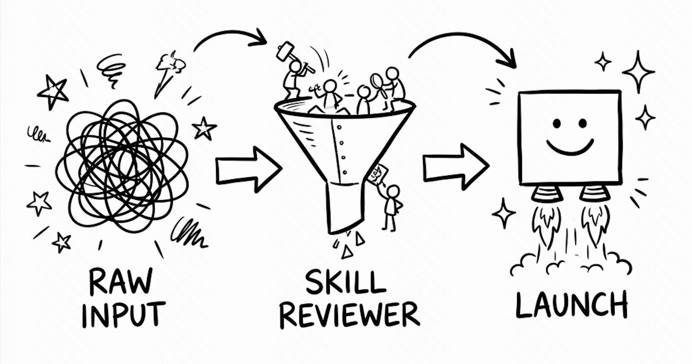

# Skill Reviewer（技能审查工具）

> 中文 | [English](README.md)



一个通用的执行审查工具，通过三层渐进式分析评估 Skill/Tool/Agent 的执行质量。

## 这是什么？

**Skill Reviewer** 是一个为 AI 原生开发设计的工具，用于系统化地分析和改进 AI Skills、Tools 和 Agents 的执行质量。它提供了一个结构化框架来：

- **诊断** 快速发现执行问题
- **评估** 判断目标是否达成
- **优化** 提升效率和实现质量

可以把它理解为代码审查系统，但针对的是 AI 执行轨迹。

## 三层分析框架

```
L1 工程正确性 ──▶ L2 目标达成度 ──▶ L3 优化空间
   执行正确吗？      效果好吗？        能更好吗？
```

- **L1（工程层）**：捕获技术错误 - 语法错误、调用失败、死循环
- **L2（目标层）**：评估有效性 - 任务是否真正完成得好？
- **L3（优化层）**：识别改进空间 - 冗余调用、token 效率、更好的方案

## 功能特性

- ✅ **通用性**：适用于任何 Skill、Tool 或 Agent
- 📊 **系统化**：三层渐进式分析
- 🎯 **可执行**：提供具体的、优先级明确的改进建议
- 🔍 **全面性**：四个输入维度确保深入分析

## 安装

### 前置要求

- 支持 MCP Skills 的 AI 编辑器（Claude Code、Cursor、Windsurf 等）
- 文件系统访问权限（用于创建符号链接）

### 通过符号链接安装

```bash
# 克隆仓库
git clone https://github.com/your-org/skill-reviewer.git
cd skill-reviewer

# 创建符号链接到你的 skills 目录
ln -s $(pwd)/skills/skill-reviewer ~/.claude/skills/skill-reviewer
```

### 验证安装

安装后，该技能应该出现在你的 AI 编辑器的技能列表中。可以通过询问 AI 助手来验证：

```
"列出可用的技能"
```

## 使用指南

### 在 Claude Code 中使用

1. **触发技能**，通过询问：
   ```
   "审查这次技能执行"
   "分析这个 agent 轨迹"
   "检查这个工具是否正常工作"
   ```

2. **提供必需的输入**（当被询问时）：
   - 执行轨迹（粘贴你的 agent 日志）
   - 原始目标（你想要达成什么）

3. **可选提供**以进行更深入的分析：
   - Skill/Tool 名称或文件路径
   - Agent 源代码路径

4. **收到结构化报告**，包含：
   - 工程问题（如果有）
   - 目标达成评级
   - 优化建议

**示例对话：**

```
你: 审查这次技能执行

Claude: 我来帮你审查执行情况。请提供：
1. [必需] 执行轨迹 - Agent 的执行过程
2. [必需] 执行目标 - 你的原始提示
3. [可选] 使用了哪个 skill/tool？

你: [粘贴执行轨迹]
    目标："生成 API 文档"
    使用的技能：doc-generator

Claude: [生成详细的审查报告]
```

### 在 Cursor 中使用

1. **打开 Cursor**，确保技能已安装（符号链接到 `~/.claude/skills/`）

2. **在聊天或 composer 中**，使用自然语言：
   ```
   "审查这个 agent 任务的执行"
   "分析这个技能的性能"
   ```

3. **提供上下文**，通过：
   - 直接在聊天中粘贴执行日志
   - 使用 `@filename` 引用文件
   - 分享终端输出

4. **获得即时反馈**和可执行的建议

**Cursor 使用技巧：**
- 使用 `@skill-reviewer` 显式调用该技能
- 使用拖放功能附加包含执行轨迹的文件
- 引用特定代码片段进行针对性分析

### 在 Windsurf 中使用

1. **确保技能已符号链接**到 `~/.claude/skills/skill-reviewer`

2. **在 cascade 模式下**，简单描述你的需求：
   ```
   "这个 agent 执行没有按预期工作，帮我审查一下"
   ```

3. **Windsurf 会自动**：
   - 加载 skill-reviewer
   - 引导你完成输入收集
   - 生成综合报告

4. **使用 flow 模式**进行交互式审查：
   - 询问关于特定执行步骤的问题
   - 深入探讨 L1/L2/L3 各层
   - 迭代优化建议

### 在其他兼容 MCP 的编辑器中使用

如果你的编辑器支持 MCP Skills：

1. **安装技能**：通过符号链接到编辑器的 skills 目录
2. **触发**：提及关键词如 "审查"、"分析"、"技能执行"
3. **按提示操作**：提供执行轨迹和目标
4. **查看输出**并应用建议

## 审查时需要提供什么

### 必需输入

| 输入 | 描述 | 如何获取 |
|------|------|----------|
| **执行轨迹** | 完整的 agent/tool 执行日志 | 从终端/聊天历史复制 |
| **执行目标** | 原始用户提示或任务描述 | 你的初始请求 |

### 可选输入（用于更深入的分析）

| 输入 | 描述 | 何时提供 |
|------|------|----------|
| **实现参考** | Skill/Tool 源代码或 SKILL.md | 审查自定义技能时 |
| **Agent 实现** | Agent 源代码 | 调查 agent 行为时 |

### 执行轨迹示例

```
用户: 生成 API 文档
↓
Agent: 读取 openapi.yaml
Agent: 调用工具: parse_openapi(file="openapi.yaml")
工具输出: [解析的结构]
Agent: 调用工具: generate_markdown(...)
工具输出: docs/api.md 已创建
结果: ✓ 文档已生成
```

## 输出示例

分析后，你将收到一份结构化报告：

```markdown
## 执行审查报告

### 基本信息
| 项目 | 内容 |
|------|------|
| 分析目标 | doc-generator 技能 |
| 执行目标 | "生成 API 文档" |

### L1: 工程正确性 ✓
✓ 所有工具调用成功
✓ 无语法错误
✓ 文件正确创建

### L2: 目标达成度 ✓✓✓
✓✓✓ 优秀
- 文档生成结构正确
- 所有 API 端点已覆盖
- 包含示例

### L3: 优化空间 💡
1. **Token 效率**: 文件被不必要地读取了两次
2. **实现方式**: 可以缓存解析后的 OpenAPI 结构
3. **输出质量**: 考虑添加目录

### 总结
执行成功，结果优秀。
优先优化项：实现缓存以减少冗余的文件读取。
```

## 项目结构

```
skill-reviewer/
├── skills/
│   └── skill-reviewer/          # 主技能
│       ├── SKILL.md             # 技能定义
│       └── references/
│           ├── input-guide.md          # 输入收集指南
│           ├── analysis-dimensions.md  # 分析检查清单
│           ├── scenarios.md            # 使用场景
│           └── report-templates.md     # 报告格式
├── discuss/                      # 设计文档
├── AGENTS.md                     # 技能开发指南
├── README.md                     # 英文文档
└── README_CN.md                  # 本文件
```

## 文档

- **[SKILL.md](skills/skill-reviewer/SKILL.md)** - 完整技能规范
- **[input-guide.md](skills/skill-reviewer/references/input-guide.md)** - 四个输入维度详解
- **[analysis-dimensions.md](skills/skill-reviewer/references/analysis-dimensions.md)** - L1/L2/L3 检查清单
- **[scenarios.md](skills/skill-reviewer/references/scenarios.md)** - 常见使用场景
- **[report-templates.md](skills/skill-reviewer/references/report-templates.md)** - 输出格式

## 贡献

欢迎贡献！请参见 [AGENTS.md](AGENTS.md) 了解：
- 技能开发标准
- 设计原则
- SKILL.md 要求
- 最佳实践

## 使用场景

### 1. 调试失败的执行
```
场景：Agent 任务失败，不确定原因
操作：提供执行轨迹 → 获得 L1 工程分析
结果：识别具体错误并修复
```

### 2. 提升性能
```
场景：任务能完成但感觉很慢
操作：请求完整的 L1-L3 审查
结果：发现冗余调用，优化 token 使用
```

### 3. 验证自定义技能
```
场景：构建了新技能，想验证质量
操作：运行测试执行 → 用 skill-reviewer 审查
结果：在生产前捕获实现问题
```

### 4. 学习最佳实践
```
场景：刚开始开发技能
操作：用 L3 分析审查示例执行
结果：学习优化模式和反模式
```

## 常见问题

**Q: 是否需要提供所有四个输入？**
A: 不需要。只有执行轨迹和目标是必需的。其他输入会增强分析深度。

**Q: 可以审查人类编写的代码吗？**
A: 它是为 AI 执行轨迹设计的，但原则也适用于代码审查。

**Q: 一次审查需要多长时间？**
A: 通常完整的 L1-L3 分析需要 1-2 分钟。

**Q: 适用于任何 Skill/Tool 吗？**
A: 是的！它与实现无关，适用于任何执行轨迹。

**Q: 可以自定义分析维度吗？**
A: 三层是标准的，但你可以 fork 并根据特定需求修改。

## 快速开始示例

### 场景 1：审查一次简单的技能执行

```bash
# 1. 在你的 AI 编辑器中说：
"帮我审查这次执行"

# 2. 粘贴执行轨迹：
"""
User: 创建一个 TODO 应用
Agent: 创建 index.html
Agent: 创建 app.js
Agent: 创建 style.css
Result: ✓ 应用已创建
"""

# 3. 提供目标：
"创建一个简单的 TODO 应用"

# 4. 获得报告
```

### 场景 2：深入分析性能问题

```bash
# 1. 触发技能：
"我的 agent 执行很慢，帮我分析一下"

# 2. 提供完整输入：
- 执行轨迹（包含时间戳）
- 原始目标
- 使用的 skill 名称
- Agent 源代码路径（可选）

# 3. 获得 L1-L3 完整报告，包括：
- 工程层问题
- 目标达成评估
- 性能优化建议
```

## 进阶用法

### 与 Git Hook 集成

在提交 Skill 代码前自动审查：

```bash
# .git/hooks/pre-commit
#!/bin/bash
echo "Running skill execution review..."
# 触发审查逻辑
```

### 批量审查多个执行

```
"审查我今天的所有 agent 执行，找出共同的优化点"
```

### 对比两次执行

```
"对比这两次执行，看看哪个实现更好"
[提供两份执行轨迹]
```

## 许可证

MIT License - 详见 LICENSE 文件

---

**为 AI 原生开发而生** 🚀
